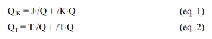
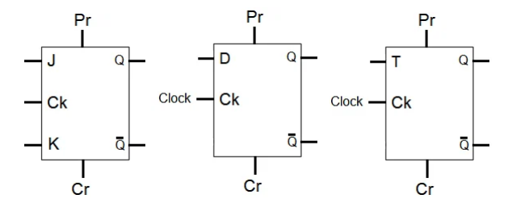
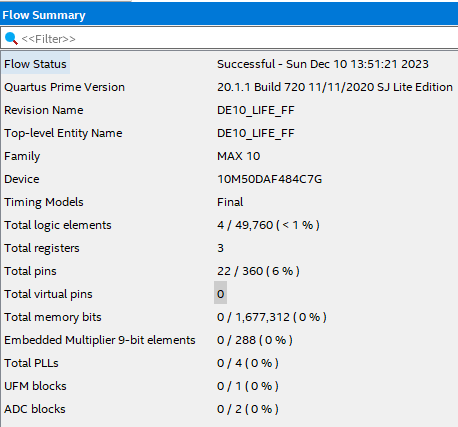
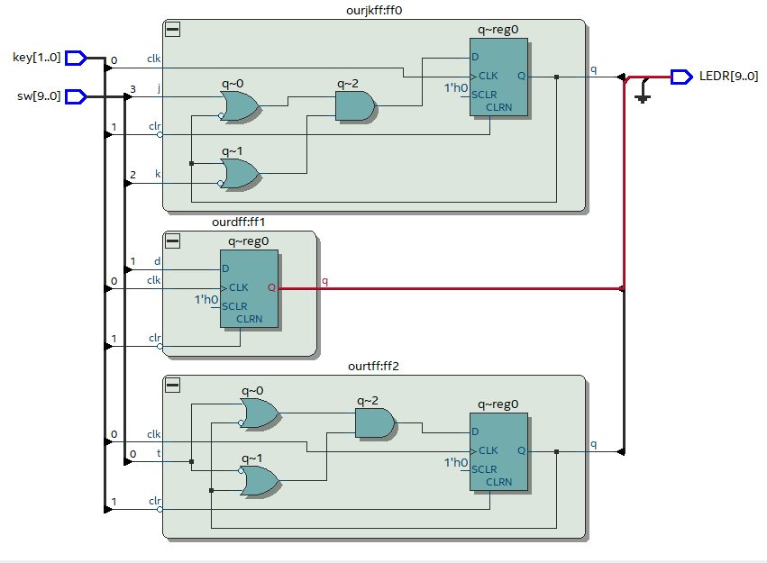

# Projeto FF

Bem-vindo ao Projeto FF! 

Nesta prática faremos a implementação de Flip Flop, vista anteriormente em Sistemas Digitais.

 Os Flip-flops (FF) são os elementos básicos dos Circuitos Sequenciais,
 assim como as portas lógicas AND, OR e NOT são dos Circuitos Combinacionais. 
 
 A partir dos FF é possível implementar
Registradores (Seriais ou Paralelos), Contadores (Assíncronos ou Síncronos) e Máquinas de Estados
Finitos (tipo Mealy ou Moore), e, a partir destes, realizar diversas aplicações, como a implementação de
Contadores de Programas (PC - Program Counter), Banco de Registradores e Unidades de Controle, na
área de Arquitetura de Computadores, por exemplo. 

Temos os principais 
- FF: JK-MS
- Tipo-D 
- Tipo-T. 

Estes podem possuir diversos
sinais de controle, além, do Clock, como Reset (Clear ou Cr), que faz sua saída Q ser igual a ‘0’, Set (ou
Preset ou Pr), que faz sua saída Q ser igual ‘1’, Clock-Enable, que habilita o funcionamento do Clock,
Output-Enable, que habilita a saída do dado armazenado por meio de uma saída em Tri-state, sendo que
estes sinais podem ser ativos em ‘1’ ou ‘0’. 

Quanto ao Clock, este pode ser ativo em borda de subida
(positiva) ou borda de descida (negativa), e quanto ao Reset e o Set, estes podem ser Síncronos,
controlado pelo Clock, ou Assíncronos, sem controle pelo Clock. 

### Objetivo

Neste relatório apresentaremos a implementação dos FF JK-MS, Tipo-D e Tipo-T, baseados na sua Equação
Característica, com reset assíncrono, utilizando a linguagem de descrição de hardware VHDL.

### Materiais Utilizados

• Kit DE10-Lite

• Aplicativo Quartus 

• Equações utilizadas: 

• Tipos de FF: 

### Resultados

O projeto deu um pouco de trabalho mas com pesquisas conseguimos conclui-lo, nós implementamos os Flip Flops JK-MS, Tipo-D e Tipo-T, com reset assíncrono.

Denominados jkff.vhd, dff.vhd e tff.vhd os tipos de FF,
com entrada de Clock clk de borda positiva, entrada de Clear clr ativa em ‘1’, uma saída q, e as entradas
j e k, d, e t, respectivamente.

Incorporamos os códigos dos FF (jkff.vhd, dff.vhd e tff.vhd) ao projeto principal, ligando as chaves SW(3 downto 0) às entradas j, k, d e t, respectivamente, o
push-button KEY(0) à entrada clk, o push-button KEY(1) à entrada clr, e a saída q dos FF JK-MS,
Tipo-D e Tipo-T aos LEDR(2 downto 0), respectivamente.

### Imagens após funcionamento do Kit

