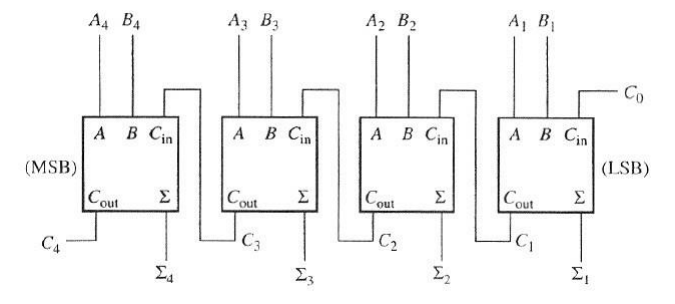
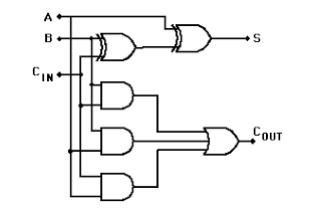
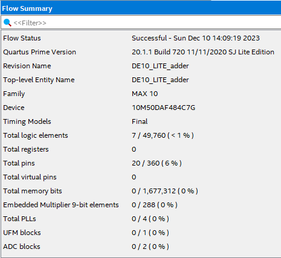
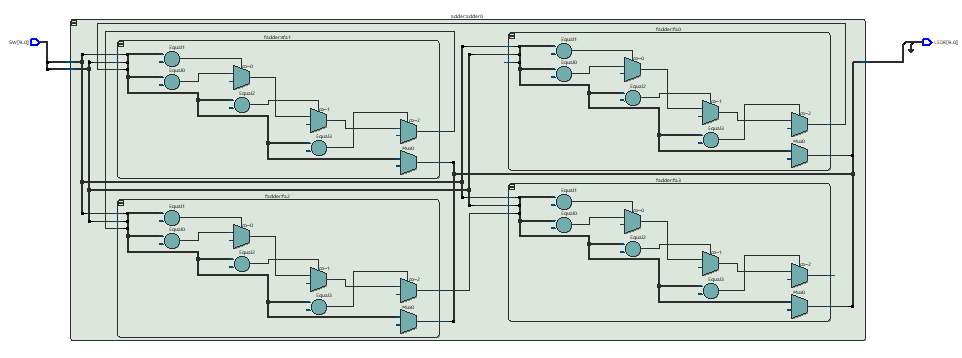

# Projeto Adder

Bem-vindo ao Projeto Adder! 

Neste projeto trabalahremos com um somador de 4 bits no kit
DE10-Lite (MAX10 10M50DAF484C7G).

Somadores são circuitos combinacionais utilizados para realizam operações matemáticas com
aritmética binária, o somador mais simples que pode ser implementado é o Ripple-Carry Chain (RPC),
 formado por somadores completos (full-adder), interligados em cascata (chain) por meio dos sinais de entrada e saída de carry.

 Desta forma, é possível implementar somadores de N bits de forma rápida e simples. esses somadores podem ser utilizados principalmente para realizar
operações de soma, mas também operações de subtração, multiplicação e comparação. Em arquiteturas
de computadores, o somador é utilizado para implementar a ULA – Unidade Lógica Aritmética, que será implementada futuramente!

### Objetivo

Este projeto de laboratório tem por objetivo a implementação de um somador de 4 bits no kit
DE10-Lite (MAX10 10M50DAF484C7G), utilizando comandos concorrentes WHEN-ELSE e WITHSELECT, dentro da linguagem de VHDL.

### Materiais Utilizados

• Kit DE10-Lite

• Aplicativo Quartus 

• Exemplo de Adder de 4 bits

• Exemplo de Adder Completo

### Resultados

A implementação do somardor foi um sucesso, utilizamos o Quartus para implementar um adder 4 bits utilizando somadores completos na
configuração de RPC.

Implementamos a entidade de projeto DE10-Lite_adder.vhd no projeto
definindo este arquivo como “Top–Level Entity”, logo em seguida solicitamos o componente somador (adder.vhd),
interligando as chaves SW e SW nas entradas A e B, respectivamente, e a
saída RESULT nos LEDs LEDR, utilizando o comando concorrente WITH-SELECT para a
saída s, e o comando concorrente WHEN-ELSE para a saída co. 

### Imagens após funcionamento do Kit

