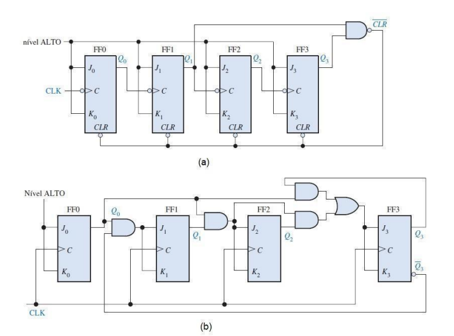

# Projeto Counter

Bem-vindo ao Projeto Counter! 

Neste projeto de laboratório vamos trabalhar com um contador binário
síncrono com reset assíncrono e com barramento de dados de tamanho parametrizável no kit DE10-Lite (MAX 10 10M50DAF484C7G).

Em projetos de sistemas digitais, os contadores podem ser utilizados principalmente para realizar
a contagem de dados, possibilitando a implementação de diversos equipamentos, como relógios,
cronômetros, multímetros etc., assim como para a divisão de frequência de uma fonte de clock,
possibilitando a geração de diversas frequências de clock a partir de uma única fonte. 

Em arquiteturas de
computadores, o contador pode ser utilizado para implementar o PC – Program Counter. Os contadores binários podem ser 
classificados, quanto ao clock, em contadores assíncronos, quando apenas o primeiro estágio recebe o sinal de clock, enquanto
 que o clock dos demais estágios depende da saída dos estágios anteriores, e contadores síncronos, quando todos os estágios 
recebem o mesmo sinal de clock, ficando a lógica combinacional responsável pela definição do próximo valor.

### Objetivo

Nesta prática nosso objetivo foi, desenvolver um um módulo contador binário com reset assíncrono e com
barramento de dados de tamanho parametrizável utilizando a linguagem VHDL.

### Materiais Utilizados

• Kit DE10-Lite

• Aplicativo Quartus 

• Exemplos de Somador: sendo (a) o assíncrono e (b) o síncrono  

### Resultados

A prática ocorreu normalmente, conseguimos implementar o projeto no Quartus, que foi implementar um contador binário síncrono parametrizável
utilizando VHDL, ligando os buttons KEY[0] e KEY[1] às
entradas clk e clrn do contador, e as saídas q aos LEDR.

### Imagens após funcionamento do Kit

