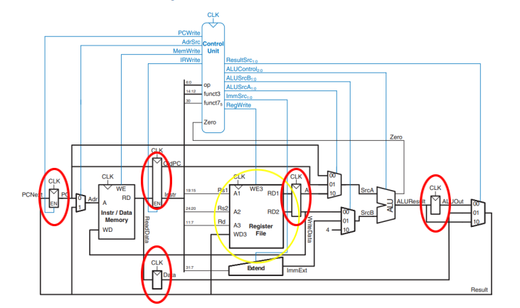
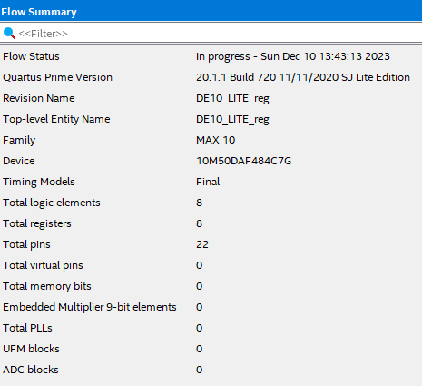
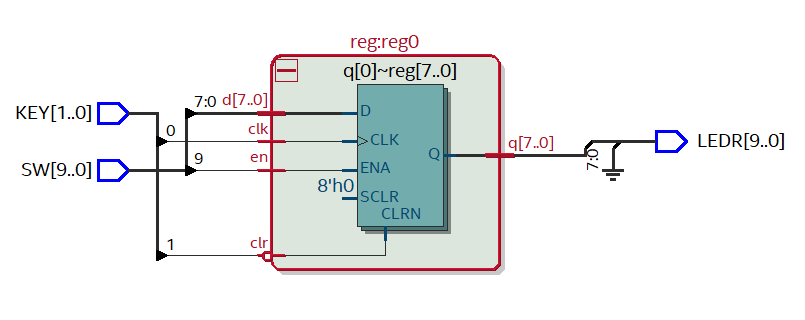

# Projeto Reg

Bem-vindo ao Projeto Reg! 
Este projeto de laboratório tem por objetivo implementar Registradores de N bits utilizando
 linguagem de descrição de hardware VHDL em projeto parametrizável. 
 
Sob o ponto de vista de Sistema Digitais, os 
Registradores são circuitos sequenciais formados por Flip-Flops (FF) que, sob o ponto de vista de Organização de 
Computadores, compõem o nível mais alto da hierarquia de memória. 

São memórias voláteis (ou seja, seus dados são perdidos quando o circuito é desligado), normalmente compostos por FF Tipo-D ligados em paralelo. 

Sua função é bastante simples: armazenar um dado de N bits por certo período de tempo. Numa arquitetura podemos classificar os 
registradores em duas classes distintas: auxiliares e de dados.

- Os registradores auxiliares são utilizados para o 
perfeito funcionamento da arquitetura, mas não são visíveis ao programador. Como exemplo temos os registradores A e B 
que são utilizados temporariamente pela ULA. 

 - Além destes temos o IR (Instruction Register), que armazena o código da 
instrução que está sendoexecutada. Os registradores de dados são aqueles utilizados pelo conjunto de instruções da 
arquitetura. No caso de uma arquitetura RISC-V, eles formam o Banco de Registradores. 

Nosso Banco de
Registradores será formado pelos registradores de R0 a RM-1. Outro registrador especial é o PC (Program Counter), 
que é utilizado para indicar, na memória, o endereço da próxima instrução a ser executada. A cada instrução executada, 
ele é atualizado para apontar para o endereço da próxima instrução a ser executada, que pode estar na próxima posição de
memória, ou em outra posição de memória gerada por uma instrução de um desvio de fluxo.

Os contadores podem ser síncronos ou assíncronos.
Desta forma, o PC pode ser implementado tanto como um registrador, acrescido de um circuito
dedicado formado por um circuito somador (para incremento de 1) e por um multiplexador (para o
desvio de fluxo), ou com um contador (síncrono ou assíncrono) com carga paralela.
Existe ainda um banco de registradores que reunirá M registradores de uso geral. Estes
registradores armazenam dados de N bits. 

### Objetivo

Como primeiro problema, nós tivemos que desenvolver um
registrador de N bits contendo os sinais de controle EN (Clock Enable) e CLK. Onde o componente a ser utilizado seria
composto uma entidade independente e em seguida utilizado como todos os registradores independentes na
organização da arquitetura.

### Materiais Utilizados

• Kit DE10-Lite

• Aplicativo Quartus 

• Exemplo de Processador RISC-V 

### Resultados

A prática foi um sucesso, conseguimos implementar um registrador genérico de N bits, cujas entradas foram CLK e EN, baseado na arquitetura RISC-V, com barramento de dados de tamanho parametrizável, utilizando a linguagem VHDL.

### Imagens após o funcionamento do Kit

